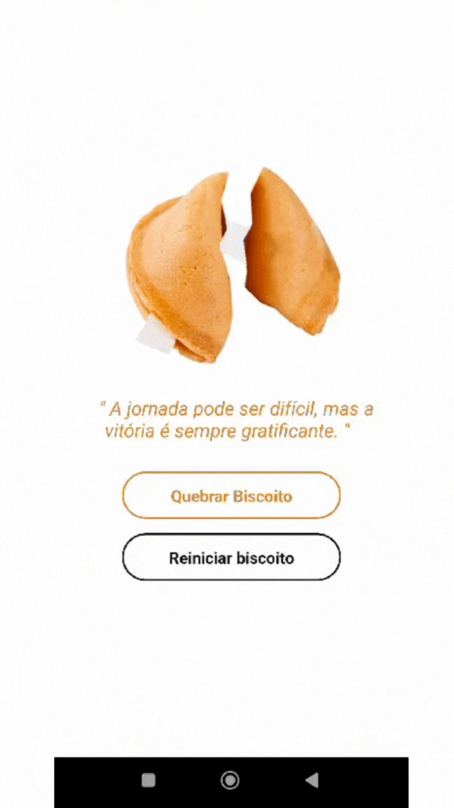

<p align="center">
   
</p>

<p align="right">
   
</p>

<h1 align="center"></h1>

<p align="center">
  

  

  

   

   

    
</p>

<p align="center">
  <a href="#dart-about">About</a> &#xa0; | &#xa0; 
  <a href="#sparkles-features">Features</a> &#xa0; | &#xa0;
  <a href="#rocket-technologies">Technologies</a> &#xa0; | &#xa0;
  <a href="#white_check_mark-requirements">Requirements</a> &#xa0; | &#xa0;
  <a href="#checkered_flag-starting">Starting</a> &#xa0; | &#xa0;
  <a href="#memo-license">License</a> &#xa0; | &#xa0;
  <a href="https://github.com/agostinhomarcia" target="_blank">Author</a>&#xa0; | &#xa0
  <a href="#" target="_blank" rel="noopener noreferrer">Projeto</a>
</p>

<br>

## :dart: About

<h4 align="center"> Biscoito da Sorte </h4>

<p align="center">
  
  
</p>

<p align="left">
 Esse projeto é  app simples que simula um "biscoito da sorte". Quando o usuário clica no botão "Quebrar Biscoito", uma frase motivacional é exibida, e a imagem do biscoito se abre. Há também um botão "Reiniciar biscoito" para restaurar a imagem do biscoito fechado e limpar a frase exibida. Ele utiliza React Native para criar a interface do aplicativo, com a exibição de imagens, texto e botões.

O estado do aplicativo é gerenciado por meio do React's useState, que controla a exibição da imagem do biscoito e a frase motivacional exibida. As frases estão pré-definidas em uma lista e são exibidas aleatoriamente quando o biscoito é "quebrado".

Os estilos são definidos usando o StyleSheet do React Native para garantir a formatação correta dos elementos na tela. A interface inclui a imagem do biscoito, o texto da frase, e dois botões estilizados para as ações de "Quebrar Biscoito" e "Reiniciar biscoito".

É um projeto simples, mas que demonstra como criar interações básicas com o usuário em um aplicativo móvel usando React Native.

</p>

## :sparkles: Features

:heavy_check_mark: Feature 1;\
:heavy_check_mark: Feature 2;\
:heavy_check_mark: Feature 3;

## :rocket: Technologies

The following tools were used in this project:

- [React-Native](https://reactnative.dev/docs/getting-started)
- [React.js](https://legacy.reactjs.org/)
- [HTML](https://developer.mozilla.org/pt-BR/docs/Web/HTML)
- [CSS](https://developer.mozilla.org/pt-BR/docs/Web/CSS)

## :white_check_mark: Requirements

Before starting :checkered_flag:, you need to have [Git](https://git-scm.com) and [Node](https://nodejs.org/en/) installed.

## :checkered_flag: Starting

```bash
# Clone this project
$ git clone https://github.com/agostinhomarcia/fortune-cookie.git
# Access
$ cd fortune-cookie
# Install dependencies
$ expo install
# Run the project
$ npx expo start
# The server will initialize in the <exp://192.168.15.2:8081>
```

## :memo: License

This project is under the [MIT license](./License).

Made with love by [Márcia Agostinho](https://github.com/agostinhomarcia) 🚀.

<p align="center">
   
</p>

&#xa0;

<a href="#top">Back to top </a>
